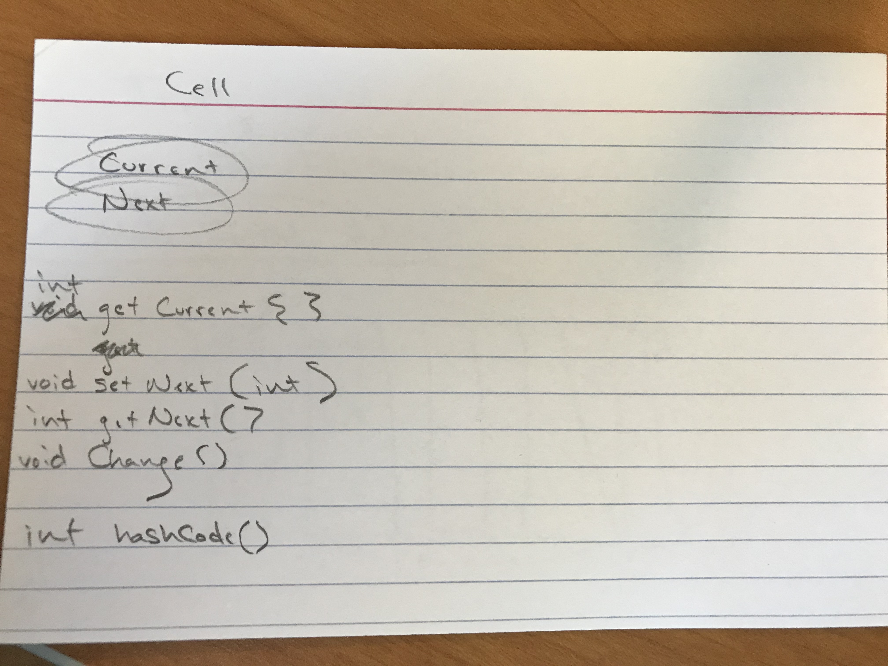
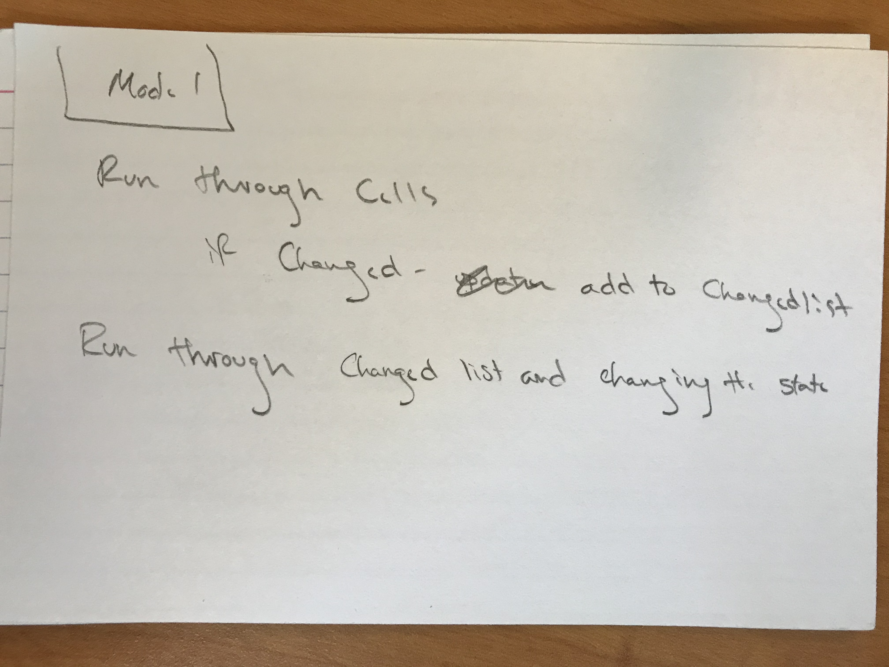
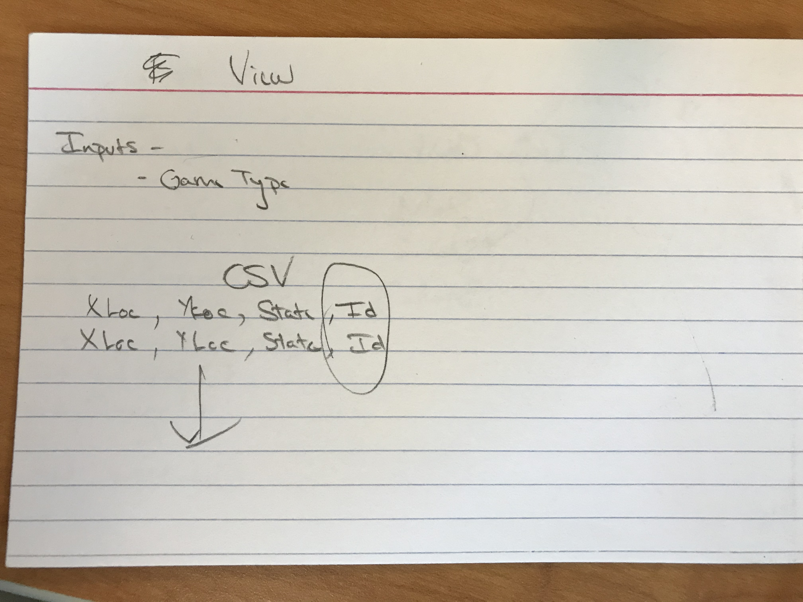
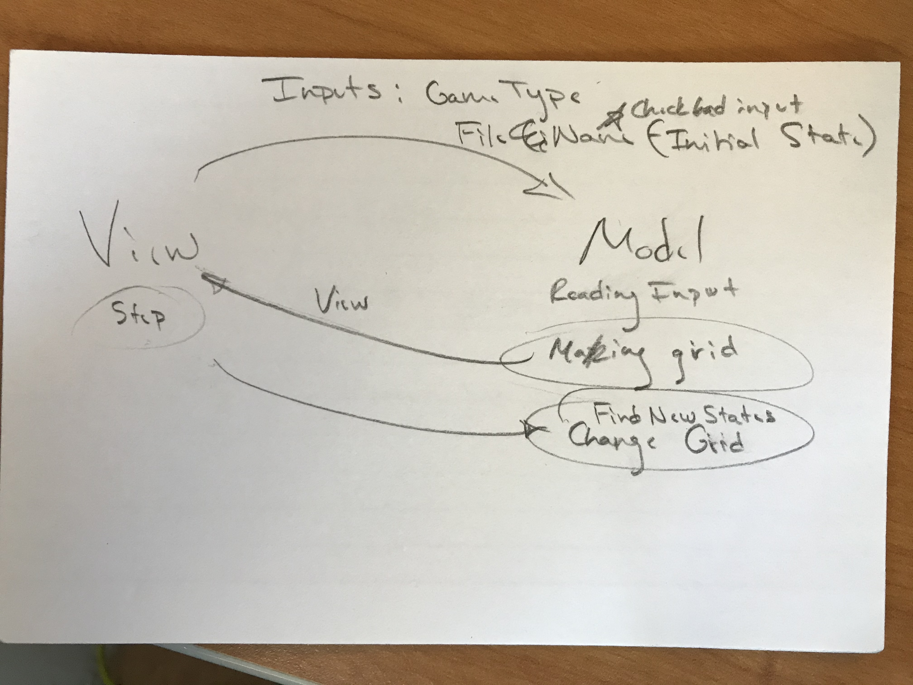

# Simulation Design Exercise

## Positive/Negative Experiences from last project
Our biggest takeaways from our last team projects were:
* Ben really liked how his team sat down before coding a single line
to design what each class would look like and how it would interact with its 
fellows classes. It made coding individually easier and made merging and integrating
individual's code much faster. He would like to do that again in the future. 
* Celine didn't like how her teammate last time, who was a great coder, did the 
majority of the implementation for Game. She would like to be treated as an equal
and be trusted with more work from her partners.
* Nicole liked how her partner last time was patient with her inexperience and
sensitive to her health issues. She hopes that her teammates will be as sympathetic,
and she will try to be with her teammates for simulation as well.
* Everyone wants to create cleaner code and use inheritance more.

##Possible Classes with General Implementations

##Design Overview
We intend to make a frontend package that deals with javafx animation and
making the grid itself, and a backend package that creates models and performs logic 
according to the type of simulation. 

####Use Case: Student wants to play a simulation
####Basic Course of Action:
Student opens simulation main class and goes to MainMenu.
* Student presses the "Play" button, which takes them to a Play Directory
* Student chooses which simulation they want to play
* Student is taken to a page where they can observe their simulation using a random basic layout.
* Student can change which basic layout they want to observe using a menu bar, choosing one of any local files.
* Student can pause animation if they want
* Student can change animation speed with slider
* Student can exit program.

##Design Details
Everything that is displayed in View should be an extended Page; Page is an abstract class that handles scenes and stages.
SimPage could be one page, the MainMenu page should be another. We hope to make a SimModel abstract class that is extended
into simulation specific classes that perform the rule-specific logic.

##Design Considerations
###Design Consideration #1: Not using a controller
We ideally want our models to pass information back and forth with the view/frontend package without
ever having to import javafx. We saw the controller-model-view model in class, but thought since the 
simulation rules were so simplistic, it didn't make a lot of sense to create a controller at this stage,
but we are open to creating a controller if need be later. 

###Design Consideration #2: Making the View universal for programs through Absolute ignorance
We want View to be able to run as many different simulations as possible without extension;
ergo, we thought it would be best for statuses, like ALIVE or DEAD, to be represented as integers within
a cell that is changed every step; these changes should be stored in an int[][] grid and called by 
view every time the animation steps without ever really knowing what simulation is being played. The int, 
however, should correspond to a color which the View associates only with that int, so the view should be flexible enough
to not ever really needing to know what the simulation model is.

##User Interface
Nicole has envisioned a Main Menu start feature similar to the one she 
created in Game; using her custom MenuBoxItems, she would like users to be able to 
click on buttons to navigate through her scenes. She envisions a play directory page where
people can choose their simulation, and from there a simulation view page that 
displays a basic grid. Colors on the grid will change depending on the simulation.
There will be a menu bar where users can click on whether they want to load a new layout for 
their simulation, and a slider to change the animation speed of the grid. 
Users will be able to navigate back to the main menu at any time. 
Users can also pause based on a button in the menu bar. 

##Team Responsibilities
Nicole really enjoys working with the frontend. She wants to handle all scenebuilding
and pages, and she wants to help with animating the grid too.

Ben enjoys a conceptual challenge and wants to tackle the backend logic.
He wants to work on the Simulation Model and implementing rules on the Cell class.

Celine wants to do a little of everything, from animation to the CSS files, which
she has never worked with before.